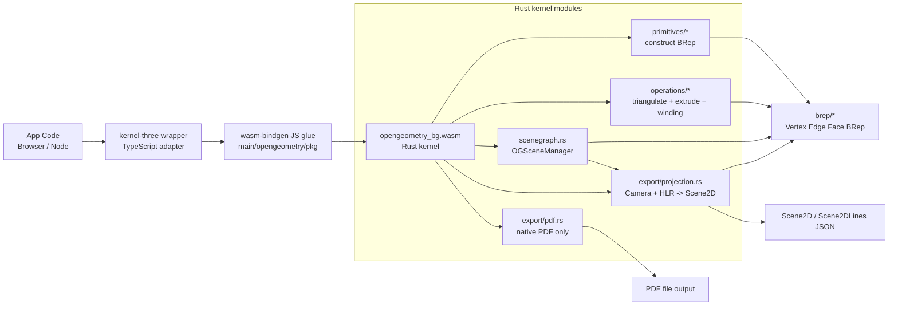
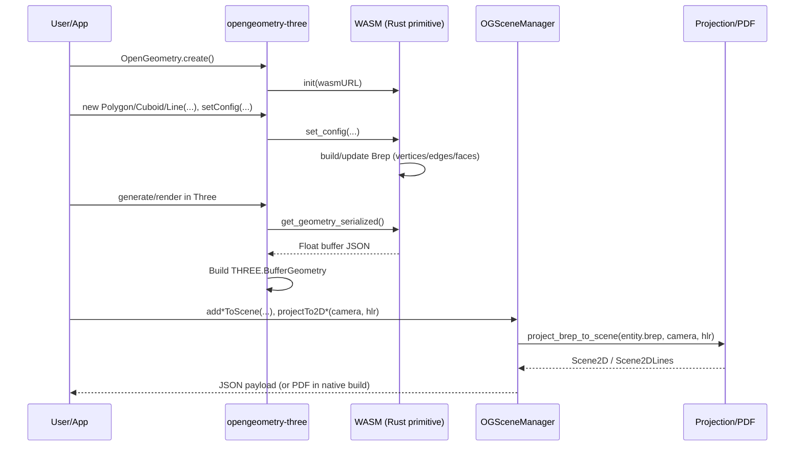
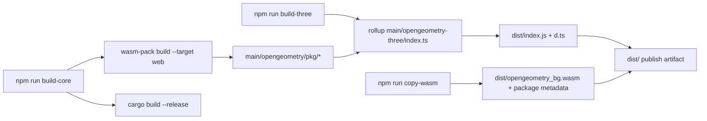

# OpenGeometry Architecture and Engine Drivers

This note documents how the repository is structured and what actually drives geometry generation, scene composition, and projection/export.

## 1) Repository Structure

```text
OpenGeometry/
├── main/
│   ├── opengeometry/                # Rust core (WASM + native)
│   │   ├── src/
│   │   │   ├── brep/                # Core topology data model (Vertex/Edge/Face/Brep)
│   │   │   ├── primitives/          # OGLine, OGPolyline, OGPolygon, OGCuboid, OGCylinder, ...
│   │   │   ├── operations/          # triangulate, extrude, winding utilities
│   │   │   ├── export/              # 2D projection + optional PDF export
│   │   │   └── scenegraph.rs        # OGSceneManager orchestration layer
│   │   └── examples/                # Projection/PDF usage samples
│   ├── opengeometry-three/          # TS/Three.js wrapper around WASM classes
│   │   ├── src/primitives/          # Three wrappers for line/arc/polyline/rectangle
│   │   └── src/shapes/              # Three wrappers for polygon/cuboid/cylinder/opening
│   ├── opengeometry-webgl/          # Package scaffold
│   └── opengeometry-babylon/        # Package scaffold
├── dist/                            # Final JS bundle + wasm binary + d.ts
├── developer.md                     # Existing hand-maintained project notes
└── knowledge.md                     # Existing domain notes
```

## 2) Component Architecture



## 3) Runtime Flow (What Drives the Engine)



### Core engine drivers

1. `Brep` is the canonical geometry/topology state.
2. Primitive `set_config` + generation methods populate `Brep`.
3. `triangulate_polygon_with_holes` (Earcut-based) drives mesh buffers for filled faces.
4. `extrude_brep_face` drives volume creation for cuboid/cylinder-style solids.
5. `OGSceneManager` drives multi-entity orchestration and projection calls.
6. `project_brep_to_scene` drives view projection, near-plane clipping, and optional hidden-line removal (`HlrOptions.hide_hidden_edges`).
7. `export_scene_to_pdf_with_config` drives native vector PDF output from projected 2D paths.

## 4) Build and Packaging Pipeline



## 5) Practical Notes

- `main/opengeometry` is the actual engine.
- `main/opengeometry-three` is the runtime adapter for Three.js.
- `main/opengeometry-webgl` and `main/opengeometry-babylon` are currently scaffolds (package metadata only).
- Projection + PDF examples in `main/opengeometry/examples/` are the fastest way to inspect real engine behavior.
