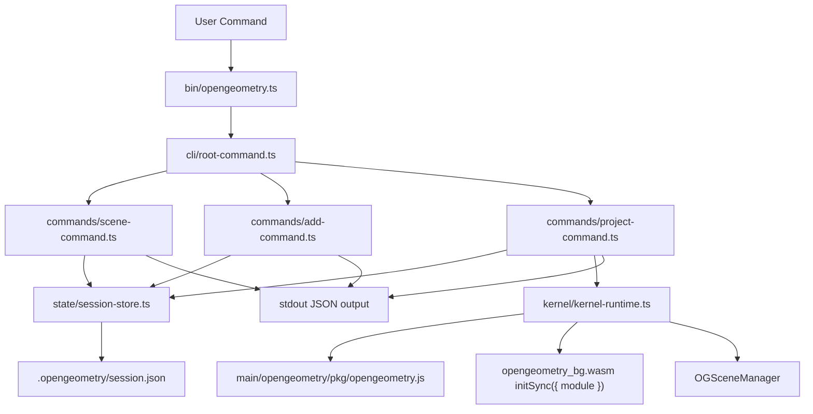

# @opengeometry/cli

TypeScript-based CLI for running OpenGeometry kernel operations from the terminal.

This subrepo currently ships a bootstrap slice focused on:
- scene management
- adding `line` entities
- projecting a scene to 2D JSON

## Current Status

Implemented commands:
- `scene create`
- `scene list`
- `scene use`
- `scene show`
- `add line`
- `project 2d`

Not implemented yet in this slice:
- other primitive types (`rectangle`, `arc`, `cuboid`, ...)
- `project lines`
- `state import/export`
- interactive mode / repl

## Prerequisites

- Node.js 20+
- OpenGeometry kernel wasm bindings present at `main/opengeometry/pkg`

## Build and Test

From repository root:

```bash
npm run lint-cli
npm run build-cli
npm run test-cli
```

From this subrepo (`main/opengeometry-cli`):

```bash
npm run lint
npm run build
npm run test
```

## Usage Examples

All examples below are run from repository root after `npm run build-cli`.

### 1) Create and inspect a scene

```bash
node main/opengeometry-cli/dist/bin/opengeometry.js scene create "Draft A"
node main/opengeometry-cli/dist/bin/opengeometry.js scene list
node main/opengeometry-cli/dist/bin/opengeometry.js scene show
```

Example output:

```json
{
  "id": "619025af-9d26-4274-a782-b1e8332dd50e",
  "name": "Draft A",
  "current": true
}
```

### 2) Add a line entity

```bash
node main/opengeometry-cli/dist/bin/opengeometry.js add line --start 0,0,0 --end 4,0,0
node main/opengeometry-cli/dist/bin/opengeometry.js scene show
```

Add to a specific scene:

```bash
node main/opengeometry-cli/dist/bin/opengeometry.js add line \
  --scene <scene-id> \
  --id line-main-axis \
  --start -2,0,0 \
  --end 2,0,0
```

### 3) Project the scene to 2D

Default camera + HLR (kernel defaults):

```bash
node main/opengeometry-cli/dist/bin/opengeometry.js project 2d --pretty
```

Use custom camera/HLR JSON files:

```bash
node main/opengeometry-cli/dist/bin/opengeometry.js project 2d \
  --scene <scene-id> \
  --camera-json ./camera.json \
  --hlr-json ./hlr.json \
  --pretty
```

`camera.json` shape:

```json
{
  "position": { "x": 3, "y": 3, "z": 3 },
  "target": { "x": 0, "y": 0, "z": 0 },
  "up": { "x": 0, "y": 1, "z": 0 },
  "near": 0.01,
  "projection_mode": "Orthographic"
}
```

`hlr.json` shape:

```json
{
  "hide_hidden_edges": true
}
```

## Architecture



### Component Explanation

- `src/bin/opengeometry.ts`:
  - thin executable entrypoint
  - forwards `argv` to the CLI root router

- `src/cli/root-command.ts`:
  - routes top-level command groups (`scene`, `add`, `project`)
  - normalizes exit codes and error messages

- `src/commands/*`:
  - command-specific handlers
  - parse options/arguments and orchestrate state + kernel calls

- `src/state/session-store.ts`:
  - reads/writes `.opengeometry/session.json`
  - validates session structure and enforces scene lookup rules

- `src/kernel/kernel-runtime.ts`:
  - initializes wasm in Node using byte-module init
  - rebuilds runtime `OGSceneManager` from persisted CLI session state
  - executes projection against kernel

## Persistence Model

Session state is stored in:
- `.opengeometry/session.json`

Stored data currently includes:
- CLI scene id + name
- current scene selection
- line entities (`start`, `end`, `id`)

Important note:
- kernel scene IDs are runtime-generated; CLI scene IDs are stable IDs stored in session state
- projection commands map CLI scene IDs to runtime scene IDs per invocation

## Troubleshooting

- `No scene selected`:
  - run `scene create <name>` or `scene use <sceneId>` first

- `Scene '<id>' does not exist in session state`:
  - verify with `scene list`

- Invalid `--start` / `--end` value:
  - expected format is exactly `x,y,z` (three finite numbers)

- Invalid camera/HLR JSON:
  - validate the JSON file parses and matches the required shape above
